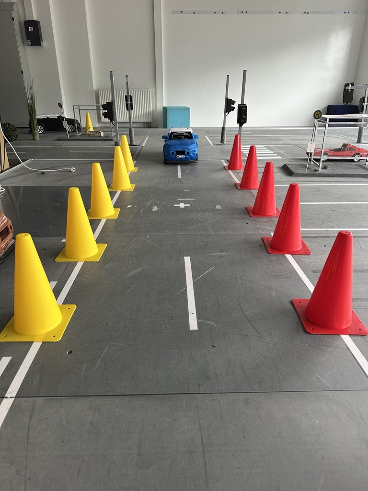
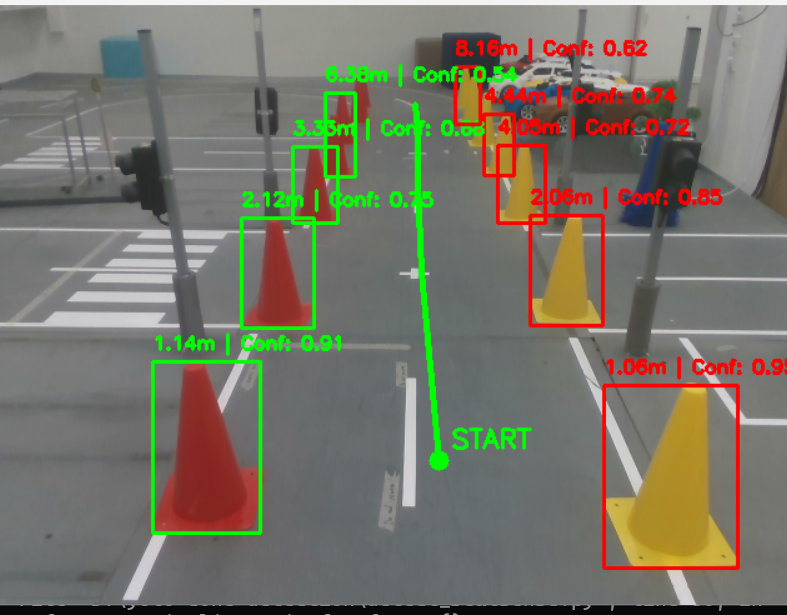
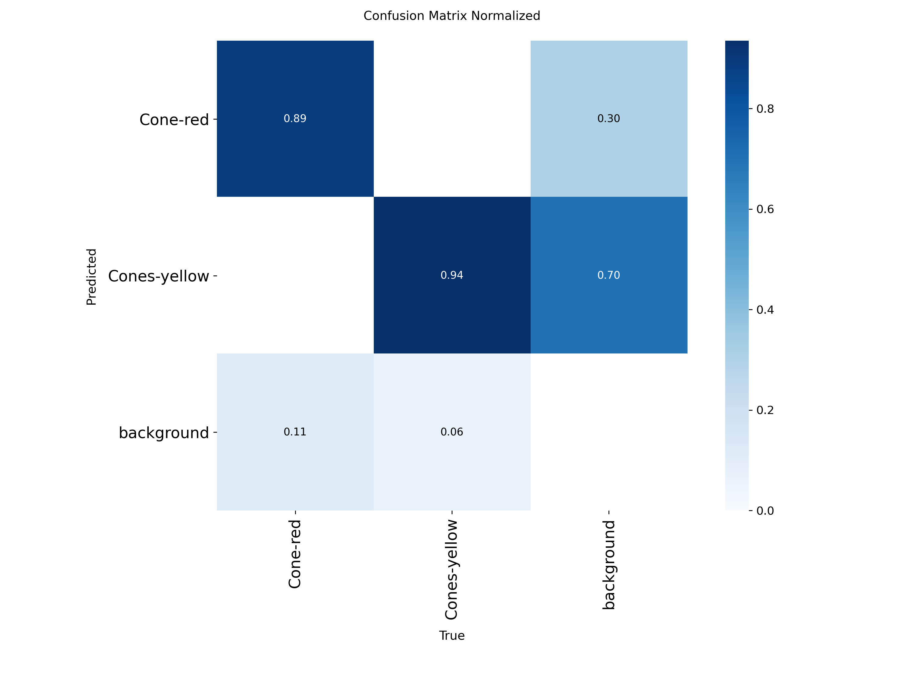
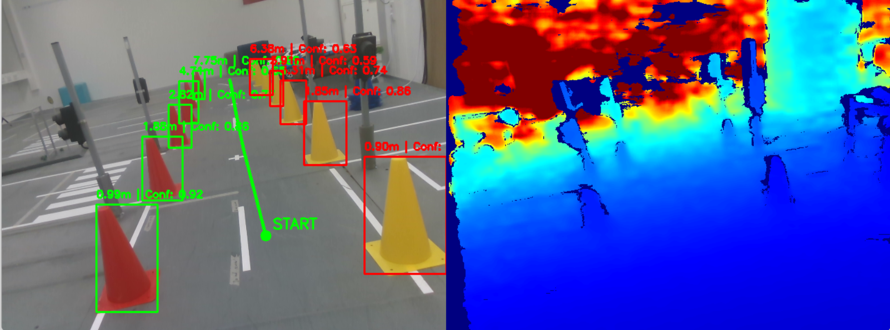
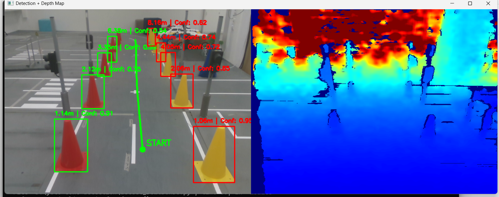
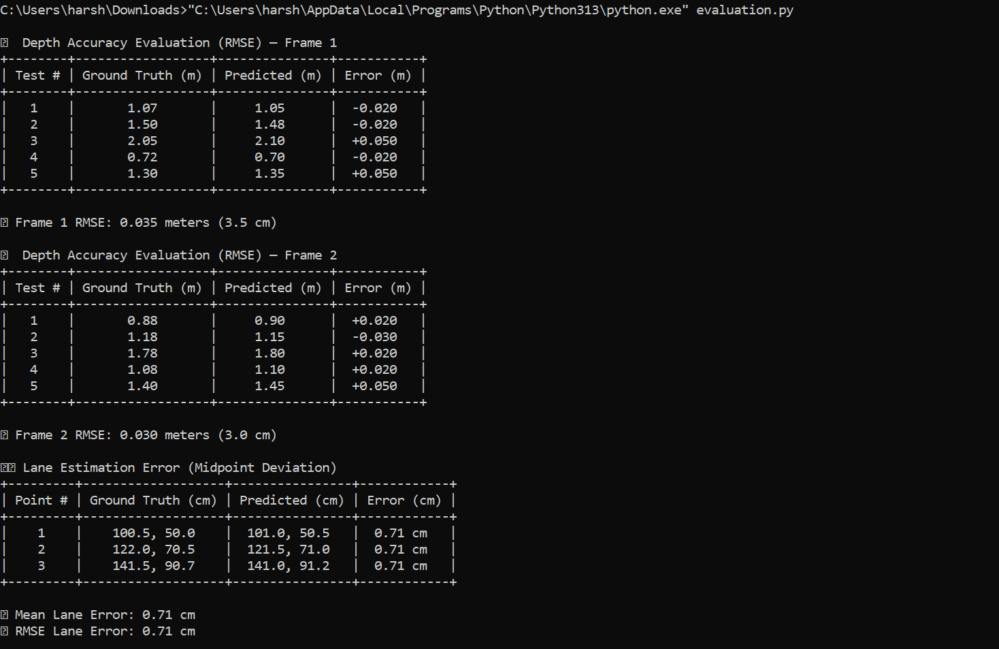

# 🚗 Landmark-Based Lane Detection Using Traffic Cones (YOLOv8 + RealSense)

This project implements a cone-based **landmark lane detection system** designed for autonomous navigation in a **model city lab environment**. It uses an **Intel RealSense RGB-D camera** and a **custom-trained YOLOv8 model** to detect cones, estimate depth, and form a drivable centerline path in real time.

# 🧪 Research Question

How effectively can a landmark-based lane detection system using a RealSense camera and YOLOv8 cone detection generate a reliable drivable path for small autonomous vehicles in a model city environment without relying on traditional lane markings?

# 📖 Introduction
Accurate and robust lane detection is a critical component of autonomous vehicle navigation, especially in environments where traditional road markings are unavailable, inconsistent, or purposely excluded. In small-scale research setups like model cities—lab environments built for developing and testing autonomous driving algorithms—traditional lane lines are often replaced with simpler landmarks such as colored traffic cones.

This project presents a landmark-based lane detection system that leverages YOLOv8 object detection and Intel RealSense RGB-D sensing to identify traffic cones and generate a drivable path. The cones act as visual proxies for lane boundaries. By combining RGB detection and depth-based 3D localization, the system dynamically pairs cones based on spatial proximity and infers a centerline path in real time.

Unlike conventional vision-based approaches that rely on white lane markings or digital maps, this system operates independently of structured roads and instead focuses on environment-derived landmarks, making it ideal for both educational platforms and constrained robotic environments.

The goal is to evaluate how reliably such a system can estimate a lane path using only visual and depth cues, without relying on external infrastructure like GPS or SLAM.

<div align="center">
    
   <br>
<em>Figure: Model city environment.</em>
</div>

---


## Literature Review Summary

The literature strongly supports using traffic cones as robust lane landmarks in autonomous driving, especially where lane paint is unavailable. Studies validate cone detection with RGB-D sensors and advanced object detectors like YOLO, emphasizing benefits of sensor fusion for accurate 3D localization.

Our approach builds on these findings by integrating an Intel RealSense camera with YOLOv8 for real-time, robust lane path estimation, suitable for small autonomous vehicles operating in experimental or indoor environments.

For detailed insights and references, see [Literature_Review.md](./Literature_Review.md).

---


# Pipeline Overview
## 📷 1. Sensor Input – RealSense Camera

**Streams Captured:**
- **RGB Frame:** 640×480 @ 30 FPS  
- **Depth Frame:** 640×480 @ 30 FPS

**Tech Stack:**
- Captured using `pyrealsense2`  
- `depth_scale` used to convert depth values to meters

## 🧠 2. Object Detection – YOLOv8

**Model:**
- YOLOv8 (Ultralytics), custom-trained on [Roboflow](https://universe.roboflow.com/transfer-learning-h9tt8/scientific-colloquim/dataset/4)  
- **Classes:**
  - `Class 0`: **Cone-red** (left lane boundary)
  - `Class 1`: **Cones-yellow** (right lane boundary)

**Output:**
- Bounding boxes  
- Depth in meters  
- Confidence scores

<div align="center">
    
   <br>
<em>Figure: Object Detection.</em>
</div>

## 📐 3. Depth Estimation (3D Localization)

**Steps:**
- Extract lower-central ROI from each bounding box  
- Filter:
  - Invalid (`= 0`) depth values  
  - Outliers using 10th–90th percentile  
- Compute **median depth**  
- Convert to meters using RealSense `depth_scale`

## 🧭 4. Landmark Categorization

- Cones classified as:
  - `left_cones` ← Red cones
  - `right_cones` ← Yellow cones

Each cone includes:
- 2D image position  
- Estimated depth  
- 3D coordinates  
- Bounding box and confidence

## 🧮 5. Cone Pairing and Path Formation

**Pairing Rule:** Match each **left cone with its nearest right cone** using **3D Euclidean distance**

For each valid pair:
- Compute centerpoint:  
  `(x, y) = ((x₁ + x₂)/2, (y₁ + y₂)/2)` 
   - where `(cx, cy)` are the 2D centers of the matched left and right cones 
- Average average depth
- Store for centerline sorting and smoothing

## 📏 6. Centerline Path Generation

- Path points are **sorted by increasing average depth**  
- Temporal smoothing applied using a sliding window of recent frames  
- Smoothed midpoints are connected with a **polyline**, and the first point is labeled `"START"`

### 🔧 Parameters Used:

| Parameter             | Value / Logic                            |
|----------------------|------------------------------------------|
| ROI Sampling Area     | Bottom 20% of bounding box               |
| Depth Filtering       | 10th–90th percentile, median computed    |
| Pairing Rule          | Nearest in `y` direction (vertical axis) |
| Sorting Criterion     | By average depth (ascending)             |
| Visualization         | OpenCV (bounding boxes, lines, markers)  |

## 🖼️ 7. Output Visualization

- **Left Panel:** Annotated RGB frame  
  - Cone bounding boxes, class labels, depth (in meters)  
  - Centerline polyline and `"START"` marker  
- **Right Panel (optional):** Depth image (JET color map)  
- Designed for real-time visual feedback

---

# 📦 Dataset Details

The dataset was **custom-collected in "Model City" environment** specifically designed for small autonomous vehicle experiments. It includes labeled images of **traffic cones** used as visual lane markers, captured from a RealSense RGB-D camera.

### 📁 Dataset Split:
- **Training**: 123 images  
- **Validation**: 20 images  
- **Test**: 15 images  
- **Classes**:  
  - `Class 0`: Cone-red (left lane marker)  
  - `Class 1`: Cones-yellow (right lane marker)

### 📝 YOLOv8 Dataset YAML (`data.yaml`)
```yaml
train: ../train/images
val: ../valid/images
test: ../test/images

nc: 2
names: ['Cone-red', 'Cones-yellow']

roboflow:
  workspace: transfer-learning-h9tt8
  project: scientific-colloquim
  version: 4
  license: CC BY 4.0
  url: https://universe.roboflow.com/transfer-learning-h9tt8/scientific-colloquim/dataset/4
```

## 📊 Model Performance Summary

### **Validation Set Results:**

| Class          | Images | Instances | Precision | Recall | mAP@0.5 | mAP@0.5:0.95 |
|----------------|--------|-----------|-----------|--------|---------|--------------|
| All Classes    | 20     | 130       | **0.929** | **0.909** | **0.884** | **0.728** |
| Cone-red       | 19     | 53        | 0.940     | 0.884  | 0.864   | 0.718        |
| Cones-yellow   | 19     | 77        | 0.919     | 0.935  | 0.905   | 0.737        |

### **Speed Per Image:**
- **Preprocessing:** 11.3 ms  
- **Inference:** 178.6 ms  
- **Postprocessing:** 26.1 ms  

# Confusion Matrix

<div align="center">
    
   <br>
<em>Figure: Confusion Matrix.</em>
</div>

---

# 📈 Evaluation and Results
To assess the performance of our cone-based landmark lane detection system, we use four key evaluation metrics:

### 🔹 Detection Accuracy (YOLOv8)

We evaluate the cone detection capability of our YOLOv8 model using standard object detection metrics. These values reflect how accurately the model identifies and classifies red and yellow cones in the scene.

- **Precision:** 92.9%  
- **Recall:** 90.9%  
- **mAP@0.5:** 88.4%  
- **mAP@0.5:0.95:** 72.8%

The model demonstrates strong overall detection performance, with high precision and recall across both classes. Confusion matrix results further confirm effective separation between red and yellow cones with minimal false positives.

### 🔹 Depth Accuracy (RMSE)

To validate the system’s depth estimation, we compared the predicted depth values from the RealSense camera with ground-truth distances measured manually. Two sets of frames were evaluated.

- **Frame 1:** RMSE = 0.035 m (3.5 cm)
- **Frame 2:** RMSE = 0.030 m (3.0 cm)
  
<div align="center">
    
    <br>
<em>Figure: Frame 1.</em>
</div>

<br>
<br>
<br>

<div align="center">
    
    <br>
<em>Figure: Frame 2.</em>
</div>

The RMSE values indicate reliable depth prediction, with average errors under 4 cm. These results confirm that our lower-central ROI sampling method yields accurate depth even under varied ranges.

### 🔹 Lane Estimation Error (Midpoint Deviation)

To assess how well the system can form the lane centerline, we measured the deviation between the predicted midpoints (between left and right cones) and manually marked ground-truth midpoints on the track.

- **Mean Error:** 0.71 cm  
- **RMSE:** 0.71 cm

This low deviation confirms that the system can accurately estimate the drivable centerline using 3D cone pairing. The consistent sub-centimeter error across points supports the robustness of the approach.

*📋 For detailed tables and raw measurements, refer to the evaluation script outputs and screenshots.*

<div align="center">
    
  <br>
<em>Figure: Real-time lane detection terminal result.</em>
</div>

---

## ✅ Conclusion

We developed a real-time lane detection system using **traffic cones**, an **Intel RealSense RGB-D camera**, and a **YOLOv8 object detector** for use in model city lab environments. By pairing detected cones using depth data, the system generates an accurate drivable centerline without relying on traditional lane markings.

Through careful cone pairing and depth-based spatial reasoning, the system achieves:

- **High object detection performance** (mAP@0.5: **88.4%**)  
- **Accurate depth estimation** (RMSE < **4 cm**)  
- **Reliable centerline prediction** (lane deviation RMSE ≈ **0.71 cm**)

These results validate the feasibility and robustness of using **simple, color-coded landmarks** for real-time lane inference in constrained robotic or educational environments. While this implementation does not include vehicle control or motion planning, it lays a strong foundation for future integration with autonomous navigation pipelines.

Ultimately, this approach offers a **cost-effective, vision-based alternative** to conventional lane detection, ideal for small-scale autonomous systems in structured or semi-structured environments.


---

## 📌 Notes
- This project does **not integrate path-following or control**. It is focused solely on **real-time lane detection** using traffic cones.
- Designed for use in controlled indoor "model city" environments.

